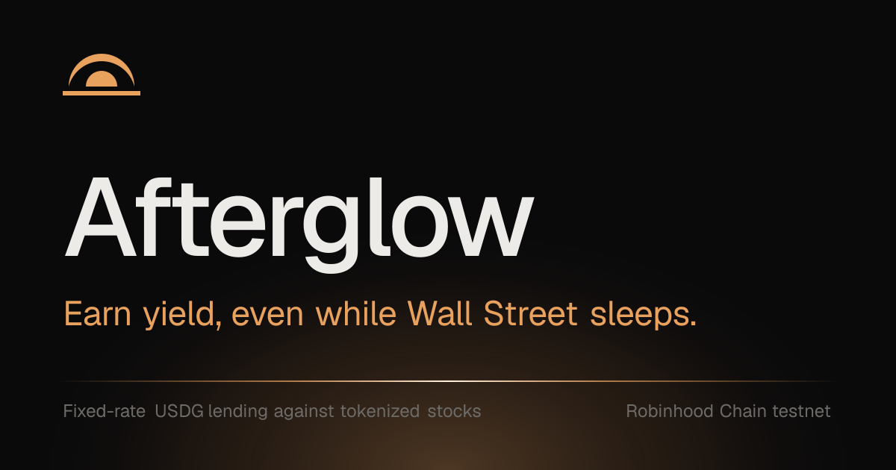
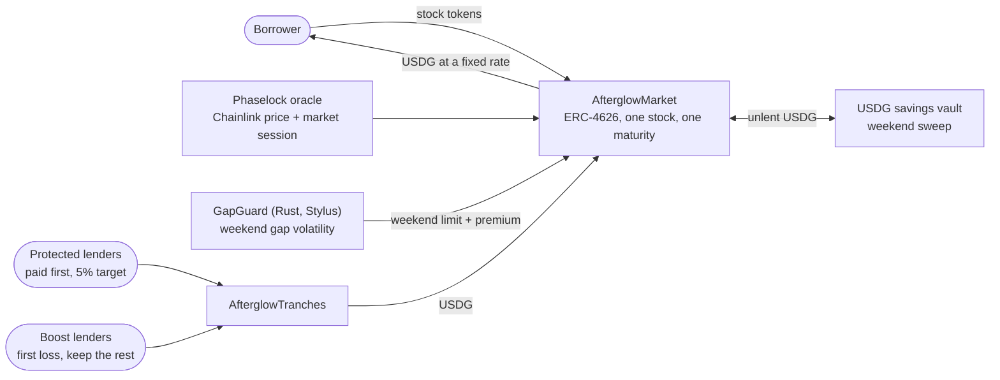

<p align="center">
  <a href="https://afterglow-credit.vercel.app">
    
  </a>
</p>

<p align="center">
  <b>Fixed-rate USDG credit against tokenized stocks, built for the weekend.</b><br>
  A lending market that follows the stock market's clock, prices weekend risk, and pays it to the lenders who choose to carry it.
</p>

<p align="center">
  <a href="https://afterglow-credit.vercel.app"><b>Live app</b></a> ·
  <a href="https://afterglow-credit.vercel.app/docs"><b>Docs</b></a> ·
  <a href="https://explorer.testnet.chain.robinhood.com/address/0xC1c055ED09962aC72c46883B8659C92f58FdAf65"><b>Explorer</b></a> ·
  <a href="docs/DESIGN.md"><b>Design notes</b></a>
</p>

<p align="center">
  <a href="https://github.com/Iamsohungrynow/afterglow/actions/workflows/test.yml"></a>
  
  
  
  
  <br>
  
  
  
  
  
  
</p>

---

## Why

Tokenized stocks trade around the clock, but their prices don't: stock feeds stop at Friday's close
(20:00 New York, when 24/5 trading closes) and resume Sunday night. On-chain lenders handle that gap badly.
They either keep lending on Friday's stale price, so a Monday gap becomes the lenders' bad debt, or they freeze
everything, so borrowers can't even repay.

Afterglow does neither:

- **Borrowers** pledge stock tokens and borrow USDG at a **fixed rate to a fixed date**. The borrow limit glides
  from 55% to 45% before the close, new borrowing pauses while prices are frozen, and **repaying and adding
  collateral always work**. Liquidations wait for a fresh price.
- **Every loan pays a weekend premium** for each weekend it spans, priced per stock from its real weekend moves.
- **Lenders pick a side of the weekend.** **Protected** is paid first at a 5% target. **Boost** takes weekend
  losses first and earns everything above that, weekend premiums included (about 25% when fully lent).
- **Unlent USDG is swept into a savings vault**, almost all of it over the weekend when nobody can borrow.

## How it works



Phaselock knows **when** the market is closed. GapGuard knows **how far a stock can jump** while it is closed.
The weekend premium puts a **price** on that jump, and Boost **earns** it.

| Contract | Purpose |
|---|---|
| [`PhaselockOracle`](src/PhaselockOracle.sol) | Chainlink price quoted in USDG + market session (Live / Closing / Closed / Halted); corporate-action, sequencer and USDG-depeg aware |
| [`AfterglowMarket`](src/AfterglowMarket.sol) | One collateral, one maturity, one fixed rate; ERC-4626 lender shares; borrow, repay, liquidate; weekend premium; weekend sweep |
| [`AfterglowTranches`](src/AfterglowTranches.sol) | Splits a market's lenders into Protected (senior, target rate, paid first) and Boost (junior, residual, first loss); Boost must stay at least 20% |
| [`GapGuard`](stylus/gap-guard/src/lib.rs) (Rust, Arbitrum Stylus) | EWMA model of each stock's weekend gaps; tightens the weekend LTV and sets the premium. Uses OpenZeppelin Contracts for Stylus |
| [`DemoSavingsVault`](src/demo/DemoSavingsVault.sol) | Testnet stand-in for a USDG savings vault (fixed 3.6% from a topped-up reserve) |

### Weekend premium

The fixed rate pays for the money; the weekend premium pays for the weekend. Every loan pays, upfront, a premium
for each weekly close before maturity:

```
premium per weekend = 10% of GapGuard's gap sigma, clamped to 2-50 bp   (TSLA: sigma 0.79% -> 7.8 bp)
premium             = amount x premium per weekend x weekends to maturity
```

Choppier stocks and longer terms pay more. The premium is kept from the amount sent to the borrower and earned by
lenders evenly until maturity (every loan shares one maturity, so this stays O(1)), so a deposit made just before
a borrow captures none of it. Protected's target is fixed, so every unit of premium lands with Boost. With a 6%
base rate and TSLA's 7.8 bp, a fully lent pool earns about 10%: Protected 5%, Boost about 25%, two thirds of it
weekend premium. When little is lent, Boost tops up Protected's target, so its yield moves with utilisation.

### Weekend sweep

| Session | Kept as cash | Why |
|---|---|---|
| Live / Closing | 20% of the pool | borrowers can draw at any moment |
| Closed (weekend) | 5% | nobody can borrow until the reopen |
| Halted, paused, matured | 100% | everything comes back |

`rebalance()` is permissionless (the target comes from the oracle, not the caller) and skips moves under 1% of the
pool. Borrows and lender withdrawals pull any shortfall from the vault in the same transaction, vault shares are
tracked internally so donations cannot move the share price, and the owner or guardian can `recallAll()`.

### Safety

Repay can never be paused · no liquidation on a frozen price · USDG depeg circuit breaker (±2%) · ERC-4626 with
virtual shares and internal cash accounting · reentrancy guards and two-step ownership · **97 unit and fuzz tests**
plus **5 fork tests** against live Robinhood Chain stock tokens and Chainlink feeds. Unaudited: testnet only.

## Deployments

**Robinhood Chain testnet (46630)**. All contracts verified on Blockscout.

| Contract | Address |
|---|---|
| PhaselockOracle | [`0xf9E4eC817db063Cb23cA6C58Ec149b8D7A3803Bc`](https://explorer.testnet.chain.robinhood.com/address/0xf9E4eC817db063Cb23cA6C58Ec149b8D7A3803Bc) |
| GapGuard (Stylus) | [`0x5D3D90d16bA7Ef507859Bb7554e6A272781b49bB`](https://explorer.testnet.chain.robinhood.com/address/0x5D3D90d16bA7Ef507859Bb7554e6A272781b49bB) |
| TSLA market | [`0xC1c055ED09962aC72c46883B8659C92f58FdAf65`](https://explorer.testnet.chain.robinhood.com/address/0xC1c055ED09962aC72c46883B8659C92f58FdAf65) |
| TSLA Protected / Boost vault | [`0x16F5f5fFDAbBB5ee8d641900ac5c14F8c84d38a0`](https://explorer.testnet.chain.robinhood.com/address/0x16F5f5fFDAbBB5ee8d641900ac5c14F8c84d38a0) |
| AMZN market | [`0xFD6Ff0BDAe852C43F078D9F321939bC894b0F253`](https://explorer.testnet.chain.robinhood.com/address/0xFD6Ff0BDAe852C43F078D9F321939bC894b0F253) |
| AMZN Protected / Boost vault | [`0x4048cA8D90584B439B343DC09c73846548539395`](https://explorer.testnet.chain.robinhood.com/address/0x4048cA8D90584B439B343DC09c73846548539395) |
| USDG savings vault (demo) | [`0x1aE87Eb2133Dd06BD67536CCcD78C071CA0544f2`](https://explorer.testnet.chain.robinhood.com/address/0x1aE87Eb2133Dd06BD67536CCcD78C071CA0544f2) |
| USDG (Paxos) | [`0x7E955252E15c84f5768B83c41a71F9eba181802F`](https://explorer.testnet.chain.robinhood.com/address/0x7E955252E15c84f5768B83c41a71F9eba181802F) |

Every address, including the tranche share tokens and price feeds, is in [`deployments/46630.json`](deployments/46630.json).

## Built with

| | Used for |
|---|---|
| **Robinhood Chain** | Home chain: stock tokens and settlement |
| **Paxos USDG** | The asset borrowed and lent; priced by Chainlink USDG/USD with a depeg circuit breaker |
| **Arbitrum Stylus** + OpenZeppelin Contracts for Stylus | `GapGuard` risk model in Rust |
| **Chainlink** | Stock and USDG prices (mainnet; mirrored to testnet, see below) |
| **ZeroDev** | Kernel smart accounts with sponsored gas: approve, deposit and borrow in one signature |
| **OpenZeppelin Contracts** | ERC-4626, access control, pausing, reentrancy guards |

## Project structure

```
src/                Solidity: PhaselockOracle, AfterglowMarket, AfterglowTranches, demo feeds and vault
stylus/gap-guard/   GapGuard, Rust on Arbitrum Stylus
test/               Foundry unit, fuzz and mainnet-fork tests
script/             Deploy script (writes deployments/<chainId>.json)
scripts/            Keeper (price mirror + sweep), seeding and setup helpers
analytics/dune/     Dune queries reproducing the on-chain GapGuard model
web/                Next.js app: landing page, docs, trading terminal, Earn, Markets, Portfolio
docs/               Design notes and assets
```

## Quick start

Requires [Foundry](https://getfoundry.sh) and Node 22.

```bash
git clone --recurse-submodules https://github.com/Iamsohungrynow/afterglow && cd afterglow
forge test                                             # unit + fuzz tests, offline
FORK=true forge test --match-path "test/fork/*"        # against Robinhood Chain mainnet state
(cd stylus/gap-guard && cargo test)                    # GapGuard (Rust) unit tests
(cd web && npm install && npm run dev)                 # app on http://localhost:3000
```

The app reads live Chainlink prices from Robinhood Chain mainnet, so it works in preview mode before any deployment.
With a ZeroDev project ID in `web/.env.local` (see `web/.env.example`), borrowers get a sponsored smart account on
Robinhood Chain testnet and Arbitrum Sepolia. `node web/scripts/smart-address.mjs <wallet>` prints the smart account
the app will create for a wallet.

## Deploy

[`script/Deploy.s.sol`](script/Deploy.s.sol) deploys `PhaselockOracle` plus one market per collateral and writes the
addresses to `deployments/<chainId>.json`; `node web/scripts/sync-deployments.mjs` copies them into the app.

| Network | Collateral | Prices | Supply cap |
|---|---|---|---|
| Robinhood Chain testnet (46630) | faucet TSLA, AMZN | `DemoPriceFeed`, mirrored from mainnet Chainlink | none |
| Robinhood Chain (4663) | NVDA, SPY, QQQ | Chainlink | 1,000 USDG per market |
| Arbitrum Sepolia (421614) | `DemoStockToken` NVDA, SPY | `DemoPriceFeed` | none |

```bash
# one-time: store the deployer key in an encrypted keystore (never in .env)
cast wallet import deployer --interactive

# dry run, then broadcast and verify on Blockscout
forge script script/Deploy.s.sol --rpc-url robinhood_testnet --account deployer
forge script script/Deploy.s.sol --rpc-url robinhood_testnet --account deployer --broadcast \
  --verify --verifier blockscout --verifier-url https://explorer.testnet.chain.robinhood.com/api/
```

Optional env: `RATE_WAD` (base borrow rate, default `0.06e18`), `SENIOR_RATE_WAD` (Protected target, default
`0.05e18`), `TERM_DAYS` (28; maturity snaps to the next Thursday 20:00 UTC), `SUPPLY_CAP` (loan-token units),
`ORACLE` (reuse a deployed oracle and its feeds), `GAP_GUARD` (wire a deployed GapGuard into every market),
`IDLE_VAULT` (savings vault for the sweep; testnets deploy a `DemoSavingsVault` when unset) and `SAVINGS_RESERVE`
(USDG sent to that demo vault as its yield reserve). `scripts\seed-demo.ps1` seeds a market with deposits and a loan.

<details>
<summary><b>GapGuard (Stylus) build and seeding</b></summary>

```bash
cd stylus/gap-guard && ./build.sh
cargo stylus check  --wasm-file target/wasm32-unknown-unknown/release/gap_guard.wasm --endpoint <rpc>
cargo stylus deploy --wasm-file target/wasm32-unknown-unknown/release/gap_guard.wasm --endpoint <rpc> --account deployer
cast send <gapGuard> "initialize(address)" <owner> --account deployer --rpc-url <rpc>   # then check owner()

# seed with real weekend history from a Chainlink feed, e.g. NVDA on Robinhood Chain
node scripts/weekend-gaps.mjs 0x379EC4f7C378F34a1B47E4F3cbeBCbAC3E8E9F15
cast send <gapGuard> "recordGaps(address,int32[])" <token> '[86,88,1,...]' --account deployer --rpc-url <rpc>
```

On Windows, `cargo-stylus` 0.10.9 needs its unix-only debugger compiled out, and `stylus-proc` is patched locally
(see [`stylus/patches`](stylus/patches)) so the macro crate links under MSVC.
</details>

<details>
<summary><b>Prices on testnet</b></summary>

Chainlink publishes equity feeds on Robinhood Chain **mainnet only**, so the testnet markets read a
Chainlink-compatible `DemoPriceFeed` (same `AggregatorV3Interface`). A GitHub Action
([`mirror-prices.yml`](.github/workflows/mirror-prices.yml) → [`scripts/mirror-prices.sh`](scripts/mirror-prices.sh))
copies every new mainnet Chainlink print for TSLA, AMZN and USDG into the testnet feeds every 30 minutes and runs the
weekend sweep, so the testnet trades on real prices and freezes over the weekend exactly when mainnet does. The
integration with the real feeds is covered by fork tests ([`test/fork/RobinhoodFork.t.sol`](test/fork/RobinhoodFork.t.sol)).

One-time setup: create a keeper wallet (`cast wallet new`), fund it from the testnet faucet, hand it the demo feeds with
`scripts\set-price-keeper.ps1 -Keeper <address>`, and store its key as the repository secret `MIRROR_PRIVATE_KEY`.
Test ETH and stock tokens: `faucet.testnet.chain.robinhood.com`; test USDG: `faucet.paxos.com`.

After US daylight saving ends (1 Nov 2026) the owner must shift the weekly close by one hour:
`setSchedule(5 days + 1 hours, 2 days, 4 hours, 1 hours)`.
</details>

## Status

Built for the Arbitrum Open House Singapore buildathon (Sep–Oct 2026). Unaudited; do not use with real funds.
[MIT licensed](LICENSE).
